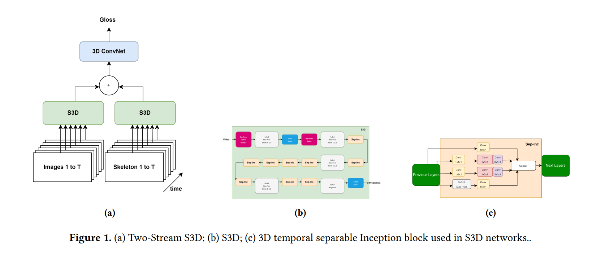

# Two Stream S3D Architecture for Word Level Sign Language Recognition


## Introduce

This repository accompanies the paper [Two Stream S3D Architecture for Word Level Sign Language Recognition](). The article addresses sign language recognition at the word level based on the Separable 3D CNN (S3D) model. We propose a low-cost model because we recognize the potential for future use of identification systems on handheld devices. We have conducted experiments on many different data sets and achieved the expected results.

## Two Stream S3D Architecture



## Dataset

We tested on three different datasets including: [Large-Scale Multimodal Turkish Signs (AUTSL)](https://ieeexplore.ieee.org/abstract/document/9210578), [Large-Scale Dataset for Word-Level American Sign Language (WLASL)](https://github.com/dxli94/WLASL), and [A Dataset for Argentinian Sign Language (LSA64)](https://facundoq.github.io/datasets/lsa64/). You can explore and download the data on our link provided in this repository.

## Data Folder

```
Root Folder
├── Videos
│   ├── Gloss_1
|   |   |──video_1.1.mp4
|   |   |──video_1.2.mp4
│   ├── Gloss_2
|   |   |──video_2.1.mp4
|   |   |──video_2.2.mp4
├── Preprocessing
│   ├── test
|   |   ├──frames
|   |   |  ├──Gloss_1
|   |   |  |  ├──video_1.1
|   |   |  |  |  ├──frame_1.1.0.jpg
|   |   |  |  |  ├──frame_1.1.1.jpg
|   |   |  ├──Gloss_2
|   |   |  |  ├──video_2.1
|   |   |  |  |  ├──frame_2.1.0.jpg
|   |   |  |  |  ├──frame_2.1.1.jpg
|   |   ├──poses
|   |   |  ├──Gloss_1
|   |   |  |  ├──video_1.1
|   |   |  |  |  ├──pose_1.1.0.jpg
|   |   |  |  |  ├──pose_1.1.1.jpg
|   |   |  ├──Gloss_2
|   |   |  |  ├──video_2.1
|   |   |  |  |  ├──pose_2.1.0.jpg
|   |   |  |  |  ├──pose_2.1.1.jpg
│   ├── train
|   |   ├──frames
|   |   |  ├──Gloss_1
|   |   |  |  ├──video_1.1
|   |   |  |  |  ├──frame_1.1.0.jpg
|   |   |  |  |  ├──frame_1.1.1.jpg
|   |   |  ├──Gloss_2
|   |   |  |  ├──video_2.1
|   |   |  |  |  ├──frame_2.1.0.jpg
|   |   |  |  |  ├──frame_2.1.1.jpg
|   |   ├──poses
|   |   |  ├──Gloss_1
|   |   |  |  ├──video_1.1
|   |   |  |  |  ├──pose_1.1.0.jpg
|   |   |  |  |  ├──pose_1.1.1.jpg
|   |   |  ├──Gloss_2
|   |   |  |  ├──video_2.1
|   |   |  |  |  ├──pose_2.1.0.jpg
|   |   |  |  |  ├──pose_2.1.1.jpg
├── folder2label_int.txt
```


